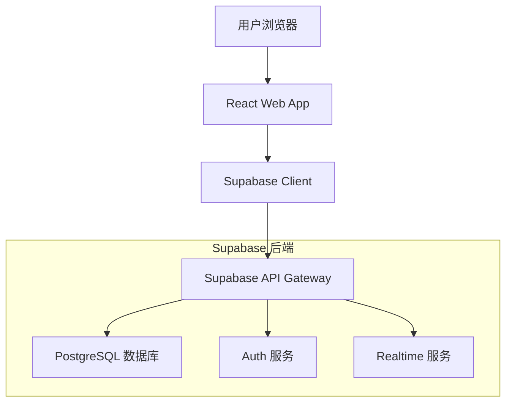
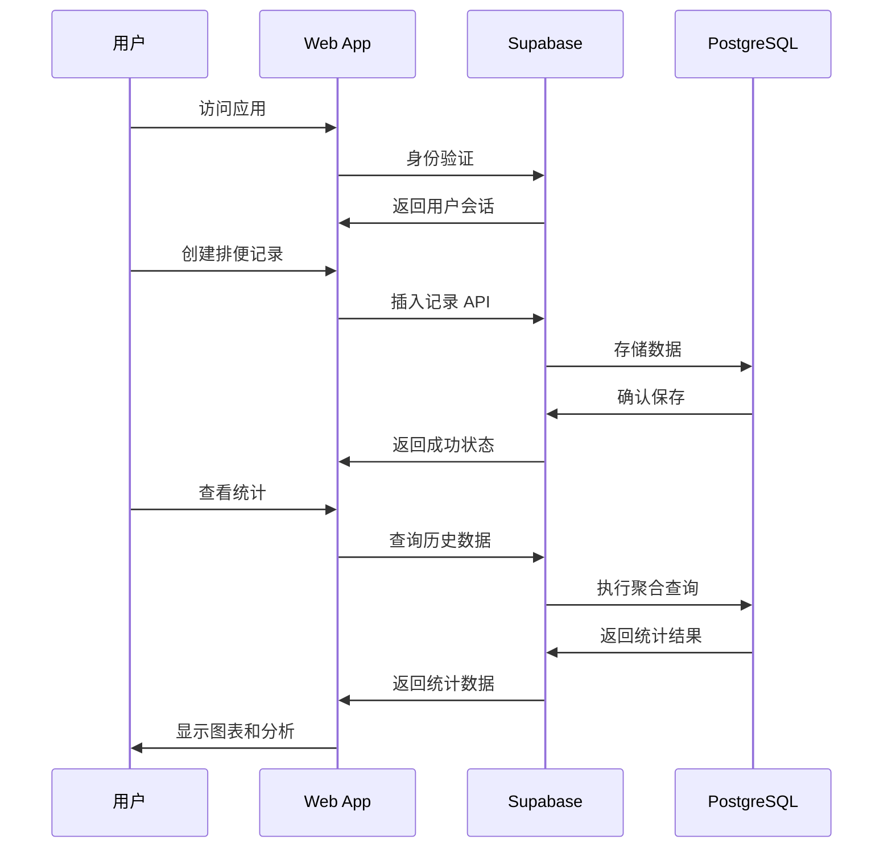
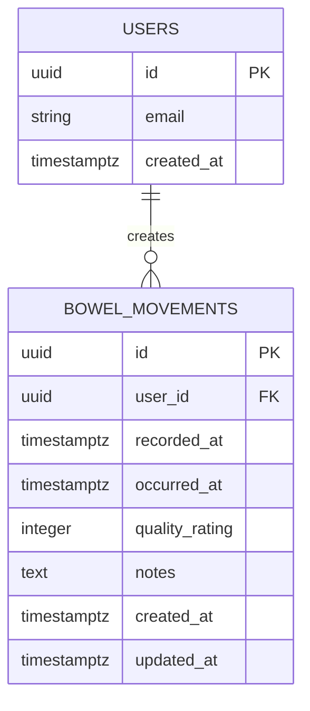

# 设计文档

## 概述

拉屎记录应用是一个基于 Web 的健康跟踪应用，使用 Supabase 作为后端服务。该应用提供简洁的用户界面来记录排便信息，并通过统计分析帮助用户了解健康趋势。

### 技术栈
- **前端**: React + TypeScript + Vite
- **后端**: Supabase (PostgreSQL + Auth + Realtime)
- **样式**: Tailwind CSS
- **部署**: Vercel (前端) + Supabase (后端)

## 架构

### 系统架构图



### 数据流架构



## 组件和接口

### 数据库模式

#### 用户表 (users)
Supabase Auth 自动管理用户认证，我们使用 `auth.users` 表。

#### 排便记录表 (bowel_movements)

```sql
CREATE TABLE bowel_movements (
    id UUID DEFAULT gen_random_uuid() PRIMARY KEY,
    user_id UUID REFERENCES auth.users(id) ON DELETE CASCADE,
    recorded_at TIMESTAMPTZ NOT NULL DEFAULT NOW(),
    occurred_at TIMESTAMPTZ NOT NULL,
    quality_rating INTEGER CHECK (quality_rating >= 1 AND quality_rating <= 7),
    notes TEXT,
    created_at TIMESTAMPTZ DEFAULT NOW(),
    updated_at TIMESTAMPTZ DEFAULT NOW()
);

-- 索引优化
CREATE INDEX idx_bowel_movements_user_id ON bowel_movements(user_id);
CREATE INDEX idx_bowel_movements_occurred_at ON bowel_movements(occurred_at);
CREATE INDEX idx_bowel_movements_user_occurred ON bowel_movements(user_id, occurred_at);
```

### 前端组件架构

```
src/
├── components/
│   ├── common/
│   │   ├── Layout.tsx
│   │   ├── Navigation.tsx
│   │   └── LoadingSpinner.tsx
│   ├── record/
│   │   ├── RecordForm.tsx
│   │   ├── RecordList.tsx
│   │   └── RecordItem.tsx
│   └── stats/
│       ├── StatsOverview.tsx
│       ├── FrequencyChart.tsx
│       └── QualityTrends.tsx
├── pages/
│   ├── HomePage.tsx
│   ├── RecordPage.tsx
│   └── StatsPage.tsx
├── hooks/
│   ├── useAuth.ts
│   ├── useRecords.ts
│   └── useStats.ts
├── services/
│   ├── supabase.ts
│   ├── recordService.ts
│   └── statsService.ts
└── types/
    └── database.ts
```

### API 接口设计

#### 记录服务 (recordService.ts)

```typescript
interface BowelMovementRecord {
  id: string;
  user_id: string;
  recorded_at: string;
  occurred_at: string;
  quality_rating: number;
  notes?: string;
  created_at: string;
  updated_at: string;
}

interface CreateRecordRequest {
  occurred_at: string;
  quality_rating: number;
  notes?: string;
}

interface RecordService {
  createRecord(data: CreateRecordRequest): Promise<BowelMovementRecord>;
  getRecords(userId: string, limit?: number): Promise<BowelMovementRecord[]>;
  getRecordsByDateRange(userId: string, startDate: string, endDate: string): Promise<BowelMovementRecord[]>;
  updateRecord(id: string, data: Partial<CreateRecordRequest>): Promise<BowelMovementRecord>;
  deleteRecord(id: string): Promise<void>;
}
```

#### 统计服务 (statsService.ts)

```typescript
interface DailyStats {
  date: string;
  count: number;
  average_quality: number;
}

interface WeeklyStats {
  week_start: string;
  total_count: number;
  daily_average: number;
  quality_average: number;
}

interface StatsService {
  getDailyStats(userId: string, days: number): Promise<DailyStats[]>;
  getWeeklyStats(userId: string, weeks: number): Promise<WeeklyStats[]>;
  getOverallStats(userId: string): Promise<{
    total_records: number;
    daily_average: number;
    most_common_quality: number;
    streak_days: number;
  }>;
}
```

## 数据模型

### 核心实体关系



### 数据验证规则

1. **质量评级**: 1-7 的整数，基于布里斯托大便分类法
2. **发生时间**: 不能是未来时间
3. **记录时间**: 自动设置为当前时间
4. **备注**: 可选，最大 500 字符
5. **用户关联**: 每条记录必须关联到认证用户

### 行级安全策略 (RLS)

```sql
-- 启用 RLS
ALTER TABLE bowel_movements ENABLE ROW LEVEL SECURITY;

-- 用户只能查看自己的记录
CREATE POLICY "Users can view own records" ON bowel_movements
    FOR SELECT TO authenticated
    USING (auth.uid() = user_id);

-- 用户只能创建自己的记录
CREATE POLICY "Users can create own records" ON bowel_movements
    FOR INSERT TO authenticated
    WITH CHECK (auth.uid() = user_id);

-- 用户只能更新自己的记录
CREATE POLICY "Users can update own records" ON bowel_movements
    FOR UPDATE TO authenticated
    USING (auth.uid() = user_id)
    WITH CHECK (auth.uid() = user_id);

-- 用户只能删除自己的记录
CREATE POLICY "Users can delete own records" ON bowel_movements
    FOR DELETE TO authenticated
    USING (auth.uid() = user_id);
```

## 正确性属性

*属性是一个特征或行为，应该在系统的所有有效执行中保持为真——本质上是关于系统应该做什么的正式声明。属性作为人类可读规范和机器可验证正确性保证之间的桥梁。*

基于需求分析，以下是系统必须满足的正确性属性：

### 属性 1: 记录数据完整性
*对于任何*有效的排便记录数据（时间、质量评级、备注），创建记录后从数据库检索应该返回相同的数据值
**验证需求: 1.2, 1.3, 1.4, 1.5**

### 属性 2: 数据持久化一致性
*对于任何*用户会话，创建记录后重新加载应用应该能够检索到所有之前创建的记录
**验证需求: 2.1, 2.2**

### 属性 3: 同日多记录支持
*对于任何*用户和日期，在同一天创建多条记录后，查询该日期应该返回所有创建的记录
**验证需求: 1.6**

### 属性 4: 统计计算准确性
*对于任何*记录集合，计算的每日平均次数应该等于总记录数除以天数
**验证需求: 3.2**

### 属性 5: 时间范围统计正确性
*对于任何*用户记录集合，周统计和月统计应该只包含指定时间范围内的记录
**验证需求: 3.3, 3.4**

### 属性 6: 图表数据一致性
*对于任何*统计数据集，生成的图表应该包含与原始统计数据相对应的所有数据点
**验证需求: 3.5**

### 属性 7: 输入验证完整性
*对于任何*无效输入（无效时间、空必填字段、过长备注），系统应该拒绝输入并显示相应错误信息
**验证需求: 5.1, 5.2, 5.4**

### 属性 8: 有效数据接受性
*对于任何*通过所有验证规则的记录数据，系统应该成功保存记录
**验证需求: 5.5**

### 属性 9: 响应式界面适配性
*对于任何*屏幕尺寸，界面应该正确适配并保持功能完整性
**验证需求: 4.2**

### 属性 10: 用户交互反馈一致性
*对于任何*用户交互操作，系统应该提供相应的视觉反馈
**验证需求: 4.5**

### 属性 11: 错误处理稳定性
*对于任何*数据库或网络错误，系统应该优雅处理并保持应用状态稳定
**验证需求: 2.3, 2.4**

## 错误处理

### 客户端错误处理

1. **网络连接错误**
   - 显示离线状态指示器
   - 缓存用户输入，连接恢复后同步
   - 提供重试机制

2. **输入验证错误**
   - 实时表单验证
   - 清晰的错误消息提示
   - 防止无效数据提交

3. **认证错误**
   - 自动重定向到登录页面
   - 保存用户当前操作状态
   - 登录后恢复操作

### 服务端错误处理

1. **数据库约束违反**
   - 返回具体的错误信息
   - 记录错误日志
   - 提供数据修复建议

2. **RLS 策略违反**
   - 返回 403 Forbidden 状态
   - 记录安全事件
   - 不泄露敏感信息

3. **数据完整性错误**
   - 事务回滚机制
   - 数据一致性检查
   - 自动修复程序

### 错误监控和日志

```typescript
interface ErrorHandler {
  logError(error: Error, context: string): void;
  notifyUser(message: string, type: 'error' | 'warning' | 'info'): void;
  reportToService(error: Error, metadata: object): void;
}
```

## 测试策略

### 测试方法

我们将主要采用基于属性的测试方法：

- **属性测试**: 验证所有输入的通用属性
- **集成测试**: 验证端到端功能流程
- 专注于核心功能验证，避免过度测试

### 基于属性的测试配置

- **测试库**: 使用 fast-check (JavaScript/TypeScript)
- **最小迭代次数**: 每个属性测试 100 次迭代
- **测试标记格式**: **Feature: bowel-movement-tracker, Property {number}: {property_text}**
- 每个正确性属性必须由单个基于属性的测试实现

### 测试覆盖范围

1. **数据层测试**
   - 数据库操作正确性
   - RLS 策略验证
   - 数据完整性约束

2. **业务逻辑测试**
   - 统计计算准确性
   - 输入验证逻辑
   - 错误处理流程

3. **UI 组件测试**
   - 组件渲染正确性
   - 用户交互响应
   - 响应式设计适配

4. **集成测试**
   - 端到端用户流程
   - API 集成正确性
   - 实时数据同步

### 测试环境配置

```typescript
// 测试配置示例
describe('Feature: bowel-movement-tracker, Property 1: 记录数据完整性', () => {
  it('should preserve all record data through create-retrieve cycle', () => {
    fc.assert(fc.property(
      fc.record({
        occurred_at: fc.date(),
        quality_rating: fc.integer({ min: 1, max: 7 }),
        notes: fc.string({ maxLength: 500 })
      }),
      async (recordData) => {
        const created = await recordService.createRecord(recordData);
        const retrieved = await recordService.getRecord(created.id);
        
        expect(retrieved.occurred_at).toEqual(recordData.occurred_at);
        expect(retrieved.quality_rating).toEqual(recordData.quality_rating);
        expect(retrieved.notes).toEqual(recordData.notes);
      }
    ), { numRuns: 100 });
  });
});
```